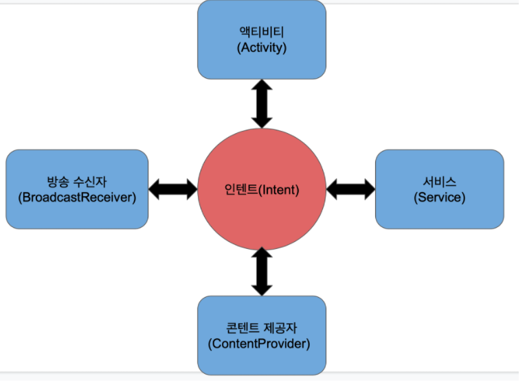

# PhotoFrame Step2
##  ConstraintLayout에 View 배치하기, assests 폴더로 부터 이미지 로드
### 결과

### 학습목표
* Constrain Layout
* ImageView의 주요 속성 

## Layout
### Layout 종류
* Linear Layout: 수직방향 혹은 수평방향 차례로 주어진 뷰를 정렬한다
* Relative Layout: 뷰들이 다른 뷰들로부터로 위치를 지정하거나, 자신이 속한 레이아웃을 기준으로 위치를 정한다.
* Constrain Layout: 뷰 사이에 수평, 수직방향의 제약을 주어 뷰들을 위치
* Table Layout: 뷰를 행과 열로 구성하여 표(테이블) 형태로 표현한다
* Frame Layout: 뷰들을 액자처럼 쌓아놓는다. 여러 뷰들을 추가하더라도 가장 나중에 추가한 뷰가 가장 위에 위치하게 된다. 레이아웃 내에 여러 뷰를 배치하는데 적합하지 않고, 주로 화면에 표시될 하나의 뷰를 바꿔가며 표시하는데 적합

### Linear Layout 기본속성
* 리니어 레이아웃은 다른 레이아웃과 다르게 방향 속성을 꼭 지정해 주어야 한다
* orientation 속성에  vertical(수직) horizontal(수평)을 지정해 주면 된다

### Layout gravity/ gravity
* gravity: View 내부의 content의 위치를 설정
* layout_gravity: 상위 View를 기준으로 했을 떄  View의 위치를 설정

### layout_weight
* 각 View에 가중치를 부여해 Width/Height을 비율로 부여한다
* 여백을 두고 싶은경우 weightSum과 함께 사용한다
* Linear Layout의 경우 수직/수평 방향에 따라 자식의 수평/수직을 0dp로 설정해줘야 작동한다

### Realtive Layout 기본 속성
* 상대적 레이아웃은 내부에 뷰를 배치할 때 기준이 되는 뷰가 존재해야 한다
* 이는 다른 뷰가 될 수도 있고, 부모 레이아웃이 될 수도 있다.
* 기본적으로 아무 위치를 지정하지않으면 부모 레이아웃의 상단,왼쪽에 배치된다
* 부모를 기준으로 하는 경우
    * layout_alignParentStart = "true"
    * layout_alignParentEnd = "true"
    * layout_centerParent = "true"
    * layout_alignParentBottom = "true"
    * layout_centerHorizontal = "true"
    * ...
    
* 다른 뷰를 기준으로 하는 경우
    * layout_toLeftOf  = @id
    * layout_above = @id
    * layout_toRightOf = @id
    * ...
* 속성정보: https://developer.android.com/reference/android/widget/RelativeLayout?hl=en

### Constrain Layout이 Linear/Relative Layout보다 많이 쓰이는 이유
* 다양한 화면 크기에 대응하는 반응형 UI를 쉽게 구성할 수 있다
* 중첩된 레이아웃을 사용하지 않고도 크고 복잡한 레이아웃을 만들 수 있다. 

### Constrain Layout 기본속성
* Constraint Layout에서 자식 뷰의 위치를 정의하려면 자식 뷰의 수직/수평 방향에 제약조건을 각각 하나이상 추가해야한다
* layout_constrainTop_toBottom/TopOf 
* layout_constrainBottom_toBottom/TopOf
* layout_constrainRight_toRight/LeftOf
* layout_constrainLeft_toRight/LeftOf
* layout_constrainStart_toEndOf
* layout_constrainEnd_toStartOf

### Constrain Layout 마진 줄떄 주의점
* 해당 방향으로 제약이 존재해야 마진이 적용된다는 규칙이 있다 

### match_constraint 속성
* layout width/height에 0dp를 준다는 것 = match_constraint를 값으로 주는것
* 제약에 뷰 크기를 맞추는 것

## ImageView
* src: 이미지뷰의 이미지 소스를 지정해주는 속성
* scaleType: 이미지 비율 조정
  * fitCenter: scaleType속성의 기본값, 가로or 세로 중 한 방향으로 스케일 된다. 이미지뷰의 센터를 기준으로 이미지 표시
  * fitXY: 가로,세로 방향으로 이미지가 이미지뷰를 빈틈없이 가득 채운다
  * center: 스케일 없이 이미지를 가운데 표시, 이미지가 뷰보다 크다면 그대로 잘리고, 작다면 작은 그대로 보여짐
  * centerCrop: 이미지 비율은 그대로 유지한 상태로 스케일 한다. 이미지 뷰를 벗어나는 부분은 잘라낸 채로 보여준다.

## Mission6 갤러리에서 사진 선택하기
### 결과

### 학습목표
* intent
* 갤러리로부터 이미지를 가져오는 방법
* Floating ActionButton 

## 컴퍼넌트

* 각 컴포넌트들은 하나의 독립적인 형태로 존재함.
* 각 컴포넌트들은 고유의 기능을 수행함.
* 각 컴포넌트들은 인텐트를 통해 서로 상호작용함

### Activity
* 액티비티는 사용자가 애플리케이션과 상호작용하는 단일화면을 의미하며 모든 안드로이드 애플리케이션은 액티비티로 구성되어 있다.
* 즉, 사용자와 상호작용을 담당하는 인터페이스
* 반드시 애플리케이션에는 하나 이상의 액티비티가 있어야 한다.
* 생명주기(Life Cycle) 관련 메서드들을 재정의하여 원하는 기능들을 구현할 수 있다

### Service
* 사용자와 직접적으로 상호작용하는 요소는 아니다
* 백그라운드에서 어떠한 작업을 처리하는데 서비스를 사용한다
* 사용자의 인터페이스를 방해하지 않고 눈에 보이지 않는 곳에서 작업을 처리한다
* but 별도의 스레드에서 동작하는 것이 아닌 액티비티와 동일한 UI스레드에서 동작함
* 별도의 UI를 가지지 않는다
* 애플리케이션이 종료되어도 이미 시작이 된 서비스는 백그라운드에서 계속 동작한다

### BroadCast Receiver
* 안드로이드 OS로부터 발생하는 각종 이벤트와 정보를 받아와 핸들링하는 컴포넌트
* 안드로이드 디바이스의 시스템 부팅시 앱 초기화, 네트워크 끈힘 그등 특수한 이벤트에 대한 처리나 베터리 부족 알림, 문자 수신같은 정보를 받아 처리해야 할 필요가 있을때 동작한다
* 즉, 안드로이드 OS에서 메신저앱 또는 문자 메시지가 오면 모든 앱에 "메시지가 왔다" 다른 하나의 어보를 방송(BroadCAst) 함

### Content Provide
* 데이터를 관리하고 다른 애플리케이션의 데이터를 제공하는데 사용되는 컴포넌트
* 특정 애플리케이션이 사용하고 있는 DB를 공유하기 위해 사용하며, 애플리케이션간의 데이터 공유를 위해 표준화된 인터페이스 제공
* SQLite DB/Web/파일 입출력 등을 통해 데이터 관리
* 외부 애플리케이션이 현재 실행중인 애플리케이션 내에 있는 DB에 함부로 접근하지 못하게 할 수 있으며, 나 자신이 공개하고 공유하고 싶은 데이터만 공유할수 있도록함
* 작은 데이터들은 인텐트로 애플리케이션끼리 서로 공유가 가능하지만, Content Provider는 음악,사진 파일등과 같이 용량이 큰 데이터들을 공유하는데 적합함
* Provider는 데이터의 읽기, 쓰기에 대한 퍼미션이 있어야 애플리케이션에 접근 가능함

## 인텐트
### 인텐트가 무엇인가
* 애플리케이션 컴포넌트간에 작업 수행을 위해 정보를 전달하는 역할, 통신수단 역할
* 컴포넌트에 액션, 데이터등을 전달한다
* 인텐트를 통하여 다른 애플리케이션의 컴포넌트를 활성화 시킬수 있다
* 실행하고자 하는 컴포넌트 정보를 담은 인텐트를 구성해서 시스템에 넘기면 시스템에서 인텐트의 정보를 분석해 맞는 컴포넌트를 실행해주는 구조

### 명시적 인텐트
* 실행하고자 하는 컴포넌트의 클래스명을 인텐트에 담는 방법
* 주로 같은 앱의 컴포넌트를 실행할 때 이용하는 방법

### 암시적 인텐트
* 클래스명이 아닌 Intent Filter 정보를 활용함
* 주로 클래스명을 알 수 없는 외부 앱의 컴포넌트를 실행할때 이용함
* 실행하려는 컴포넌트의 AndroidManifest.xml 파일에 정의된 intent-filter 정보와 동일한 값을 주어 실행하는 것이 암시적 인텐트입니다.

### 인텐트 필터
* action
  * 컴포넌트가 어떤 능력을 갖추고 있는지에 대한 문자열,  개발자가 임의로 지정하는 단어도 가능하며, 라이브러리에서 지정한 문자열을 이용해도됨
* category
  * 컴포넌트에 대한 추가정보로 점주의 컴포넌트인지를 표현하는 데 사용됩니다.  개발자가 임의로 지정하는 단어도 가능하지만, 거의 대부분 라이브러리 내에서 준비된 단어를 사용합니다
  * startActivity()나 startActivityForResult() 메서드로 암시적 인텐트를 실행할 경우 코드에서 지정하지 않아도 CATEGORY_DEFAULT가 선언된 것처럼 행동합니다. 따라서 category 태그로 DEFAULT를 무조건 넣어야 합니다.
  
* data
  * 컴포넌트를 실행하기 위해 필요한 데이터에 대한 상세 정보를 명시하기 위해 사용됩니다
  *  URL 형식으로 표현되어 android:scheme, android:host, android:port , android:mimeType 등으로 선언
  
* <intent-filter> 요소를 포함하는 컴포넌트안에 android:exported 값을 명시적으로 넣어야 한다
* 이 속성은 앱 구성 요소가 다른 앱에 엑세스 할 수 있는지 여부를 나타낸다. 

